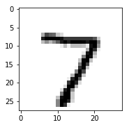
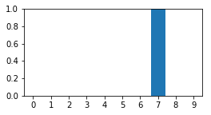

# Dnn


```python
import tensorflow as tf
import numpy as np
import matplotlib.pyplot as plt
from tensorflow.examples.tutorials.mnist import input_data
```


```python
#Call tf.reset_default_graph() before you build your model (and the Saver). This will ensure that the variables get the names you intended, but it will invalidate previously-created graphs.
tf.reset_default_graph() 

# random number seed
np.random.seed(0)
tf.set_random_seed(0)

# load data
mnist = input_data.read_data_sets("./data/", one_hot=True)
```

    Extracting ./data/train-images-idx3-ubyte.gz
    Extracting ./data/train-labels-idx1-ubyte.gz
    Extracting ./data/t10k-images-idx3-ubyte.gz
    Extracting ./data/t10k-labels-idx1-ubyte.gz


## Define Model
4 Layers with 1000, 1000, 1000, 10 nodes each.<br>
The last layer's activation function is softmx and other's are relu.

### Define Layers


```python
# input data
x = tf.placeholder(tf.float32, [None, 784])

# 1st fully connected layer
w1 = tf.Variable(tf.truncated_normal([784, 1000]))
b1 = tf.Variable(tf.constant(0.1, shape=[1000]))
hidden1 = tf.nn.relu(tf.matmul(x, w1) + b1)

# check dim
print(x.get_shape())
print(w1.get_shape())
print(b1.get_shape())
print(hidden1.get_shape())
```

    (?, 784)
    (784, 1000)
    (1000,)
    (?, 1000)


```python
# 2nd fully connected layer
w2 = tf.Variable(tf.truncated_normal([1000, 1000]))
b2 = tf.Variable(tf.constant(0.1, shape=[1000]))
hidden2 = tf.nn.relu(tf.matmul(hidden1, w2) + b2)

# check dim
print(w2.get_shape())
print(b2.get_shape())
print(hidden2.get_shape())
```

    (1000, 1000)
    (1000,)
    (?, 1000)


```python
# 3rd fully connected layer
w3 = tf.Variable(tf.truncated_normal([1000, 1000]))
b3 = tf.Variable(tf.constant(0.1, shape=[1000]))
hidden3 = tf.nn.relu(tf.matmul(hidden2, w3) + b3)

# check dim
print(w3.get_shape())
print(b3.get_shape())
print(hidden3.get_shape())
```

    (1000, 1000)
    (1000,)
    (?, 1000)


```python
# ouput layer
w4 = tf.Variable(tf.zeros([1000, 10]))
b4 = tf.Variable(tf.zeros([10]))
output = tf.matmul(hidden3, w4) + b4
output_after_softmax = tf.nn.softmax(output)

# check dim
print(w4.get_shape())
print(b4.get_shape())
print(output.get_shape())
print(output_after_softmax.get_shape())
```

    (1000, 10)
    (10,)
    (?, 10)
    (?, 10)


### Define Cost function


```python
#define loss (cost) function
true_labels = tf.placeholder(tf.float32, [None, 10])
loss = tf.reduce_mean(tf.nn.softmax_cross_entropy_with_logits(logits = output, labels = true_labels)) 
train_step = tf.train.AdamOptimizer(0.0001).minimize(loss)
correct_prediction = tf.equal(tf.argmax(output_after_softmax, 1), tf.argmax(true_labels, 1))
accuracy = tf.reduce_mean(tf.cast(correct_prediction, tf.float32))
```

## Training and Testing


```python
# prepare session
sess = tf.InteractiveSession()
sess.run(tf.global_variables_initializer())
saver = tf.train.Saver()


# start training
training_epochs = 5
batch_size = 500
train_data_size = mnist.train.num_examples
total_batch = int(train_data_size/batch_size)

# Training cycle
for epoch in range(training_epochs):
    print ('epoch %f in %f'% (epoch+1, training_epochs))
    
    # generate random indexes
    indexes = np.random.permutation(train_data_size)
    
    # Loop over all batches
    for position in range(0, train_data_size, batch_size):
        # generate mini batch ids
        ids = indexes[position:(position+batch_size) if (position+batch_size) < train_data_size else train_data_size]
        batch_xs = mnist.train.images[ids]
        batch_ts = mnist.train.labels[ids]
        sess.run(train_step,feed_dict={x:batch_xs, true_labels:batch_ts})
        
    # now we test model per epoch
    loss_val, acc_val = sess.run([loss, accuracy],feed_dict={x:mnist.test.images,true_labels:mnist.test.labels})
    print ('epoch: %d, Loss: %f, Accuracy: %f'% (epoch+1, loss_val, acc_val))
    
saver.save(sess, './model/dnn_session')
sess.close()
```

    epoch 1.000000 in 5.000000
    epoch: 1, Loss: 1.763942, Accuracy: 0.916200
    epoch 2.000000 in 5.000000
    epoch: 2, Loss: 0.822287, Accuracy: 0.932300
    epoch 3.000000 in 5.000000
    epoch: 3, Loss: 0.720912, Accuracy: 0.932500
    epoch 4.000000 in 5.000000
    epoch: 4, Loss: 0.757762, Accuracy: 0.928900
    epoch 5.000000 in 5.000000
    epoch: 5, Loss: 0.828864, Accuracy: 0.924100


# Load DNN


```python
import tensorflow as tf
import numpy as np
import matplotlib.pyplot as plt
%matplotlib inline
from tensorflow.examples.tutorials.mnist import input_data
```


```python
#Call tf.reset_default_graph() before you build your model (and the Saver). This will ensure that the variables get the names you intended, but it will invalidate previously-created graphs.
tf.reset_default_graph() 

# random number seed
np.random.seed(0)
tf.set_random_seed(0)

# load data
mnist = input_data.read_data_sets("./data/", one_hot=True)
```

    Extracting ./data/train-images-idx3-ubyte.gz
    Extracting ./data/train-labels-idx1-ubyte.gz
    Extracting ./data/t10k-images-idx3-ubyte.gz
    Extracting ./data/t10k-labels-idx1-ubyte.gz


## Define Model before loading


```python
# input data
x = tf.placeholder(tf.float32, [None, 784])

# 1st fully connected layer
w1 = tf.Variable(tf.truncated_normal([784, 1000]))
b1 = tf.Variable(tf.constant(0.1, shape=[1000]))
hidden1 = tf.nn.relu(tf.matmul(x, w1) + b1)

# 2nd fully connected layer
w2 = tf.Variable(tf.truncated_normal([1000, 1000]))
b2 = tf.Variable(tf.constant(0.1, shape=[1000]))
hidden2 = tf.nn.relu(tf.matmul(hidden1, w2) + b2)

# 3rd fully connected layer
w3 = tf.Variable(tf.truncated_normal([1000, 1000]))
b3 = tf.Variable(tf.constant(0.1, shape=[1000]))
hidden3 = tf.nn.relu(tf.matmul(hidden2, w3) + b3)

# ouput layer
w4 = tf.Variable(tf.zeros([1000, 10]))
b4 = tf.Variable(tf.zeros([10]))
output = tf.matmul(hidden3, w4) + b4
output_after_softmax = tf.nn.softmax(output)

#define loss (cost) function
true_labels = tf.placeholder(tf.float32, [None, 10])
loss = tf.reduce_mean(tf.nn.softmax_cross_entropy_with_logits(logits = output, labels = true_labels)) 
# train_step = tf.train.AdamOptimizer(0.0001).minimize(loss)
correct_prediction = tf.equal(tf.argmax(output_after_softmax, 1), tf.argmax(true_labels, 1))
accuracy = tf.reduce_mean(tf.cast(correct_prediction, tf.float32))
```

## Load model


```python
# prepare session
sess = tf.InteractiveSession()
sess.run(tf.global_variables_initializer())
saver = tf.train.Saver()
saver.restore(sess, "./model/dnn_session")
```

## Exploits model


```python
# now we test model per epoch
loss_val, acc_val = sess.run([loss, accuracy],feed_dict={x:mnist.test.images,true_labels:mnist.test.labels})
print ('Loss: %f, Accuracy: %f'% (loss_val, acc_val))
```

    Loss: 0.828864, Accuracy: 0.924100


```python
fig = plt.figure(figsize=(8, 6))
ax0 = fig.add_subplot(2, 1, 1)
ax0.imshow(mnist.test.images[0].reshape([28, 28]),cmap=plt.cm.gray_r, interpolation='nearest')
```


    <matplotlib.image.AxesImage at 0x1219b4128>





```python
p_val = sess.run(output_after_softmax, feed_dict={x:[mnist.test.images[0]]})

fig = plt.figure(figsize=(4,2))
pred = p_val[0]
subplot = fig.add_subplot(1,1,1)
subplot.set_xticks(range(10))
subplot.set_xlim(-0.5,9.5)
subplot.set_ylim(0,1)
subplot.bar(range(10), pred, align='center')
plt.show()
```




